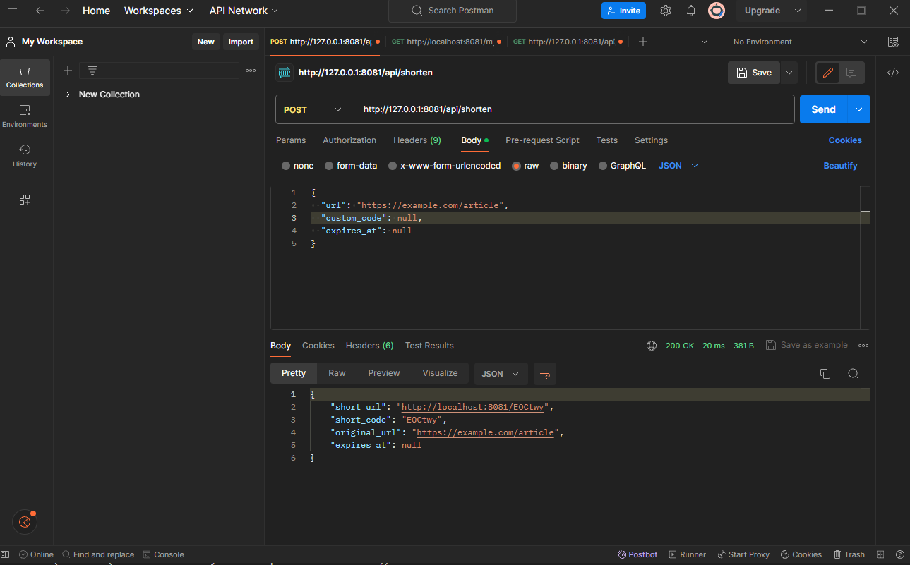
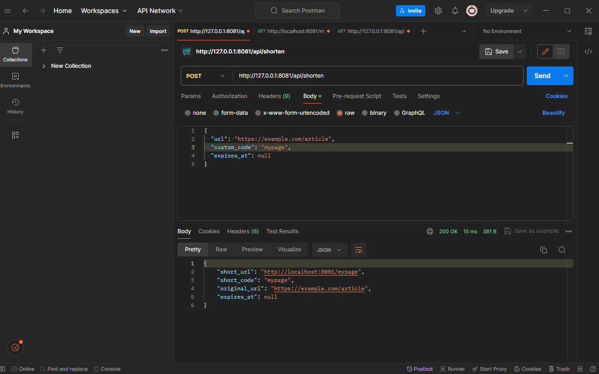
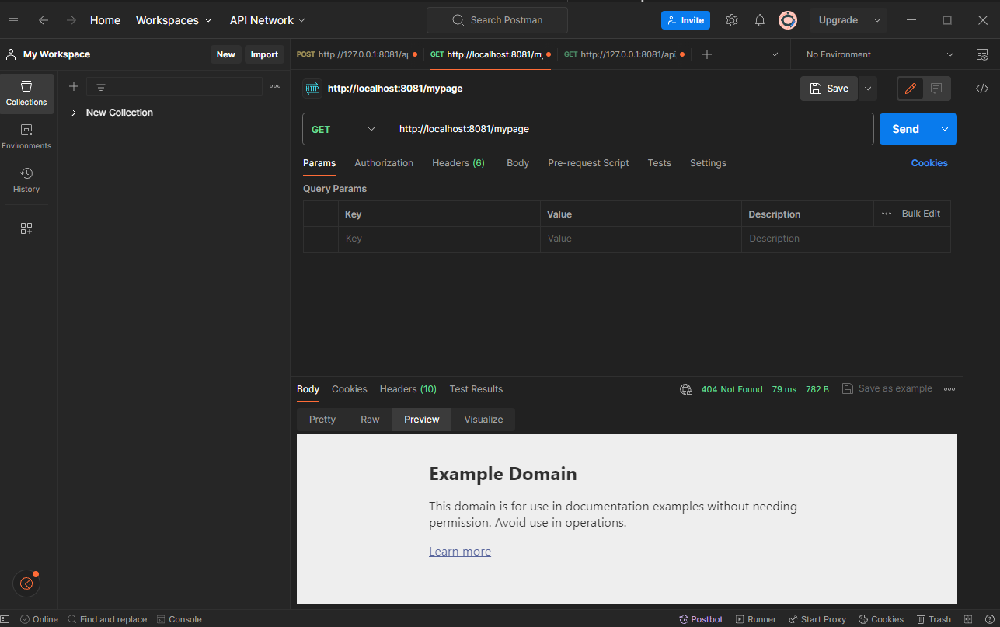

# URL Shortener

A full-stack URL shortening service built with Rust, featuring analytics, QR code generation, and rate limiting.

## Overview

This project is a production-ready URL shortener similar to bit.ly. It converts long URLs into short, memorable links while tracking clicks and providing detailed analytics. The application demonstrates real-world web development challenges including collision detection, rate limiting, data persistence, and user analytics.

## Features

- URL shortening with auto-generated or custom short codes
- Click tracking and analytics (total clicks, unique visitors, geographic data)
- QR code generation for shortened URLs
- Rate limiting (10 requests per minute per IP)
- URL expiration dates
- Web dashboard for managing URLs
- RESTful API for programmatic access
- Geographic analytics (country and city tracking)
- Referrer tracking

## Technology Stack

- **Backend**: Rust with Axum web framework
- **Database**: SQLite with SQLx
- **Frontend**: HTML, CSS, JavaScript
- **Rate Limiting**: Governor crate
- **QR Codes**: qrcode crate
- **Geolocation**: IP-API.com (free tier)

## Project Structure

```
url_shortener/
├── src/
│   ├── main.rs                 # Application entry point and routing
│   ├── config.rs              # Configuration from environment variables
│   ├── error.rs               # Custom error types and HTTP responses
│   ├── models/
│   │   ├── mod.rs
│   │   ├── url.rs             # URL data structures
│   │   └── click.rs           # Click analytics structures
│   ├── db/
│   │   ├── mod.rs
│   │   └── queries.rs         # Database query functions
│   ├── handlers/
│   │   ├── mod.rs
│   │   ├── shorten.rs         # URL creation endpoints
│   │   ├── redirect.rs        # Short URL redirect handler
│   │   ├── analytics.rs       # Statistics and QR code endpoints
│   │   └── web.rs             # Web page handlers
│   ├── services/
│   │   ├── mod.rs
│   │   ├── shortener.rs       # Code generation and validation
│   │   ├── rate_limiter.rs    # Per-IP rate limiting
│   │   ├── qr_code.rs         # QR code generation
│   │   └── geolocation.rs     # IP to location mapping
│   └── templates/
│       └── mod.rs
├── static/
│   ├── css/
│   │   └── styles.css         # Application styles
│   └── js/
│       └── app.js             # Frontend JavaScript
├── migrations/
│   ├── TIMESTAMP_create_urls_table.sql
│   └── TIMESTAMP_create_clicks_table.sql
|── templates/
|   ├── dashboard.html
│   └── index.html
├── .env                       # Environment configuration
├── Cargo.toml                 # Rust dependencies
└── README.md
```

## Architecture

The application follows a layered architecture:

### HTTP Layer (handlers/)
Receives HTTP requests, validates input, and returns responses. Each handler focuses on a specific route or group of routes.

### Service Layer (services/)
Contains business logic, validation, and algorithms. Services are independent of HTTP and can be reused across different interfaces.

### Data Layer (db/)
Manages database queries and data persistence. Provides a clean interface for CRUD operations.

### Models (models/)
Defines data structures used throughout the application. Handles serialization and deserialization.

## Setup and Installation

### Prerequisites

- Rust (latest stable version)
- SQLite3 (optional, for manual database inspection)

### Installation Steps

1. Clone the repository:
```bash
git clone <repository-url>
cd url_shortener
```

2. Create environment configuration:
```bash
cp .env.example .env
```

3. Edit `.env` with your settings:
```env
DATABASE_URL=sqlite:url_shortener.db
SERVER_HOST=127.0.0.1
SERVER_PORT=8080
BASE_URL=http://localhost:8080
RATE_LIMIT_PER_MINUTE=10
SHORT_CODE_LENGTH=6
```

4. Build the project:
```bash
cargo build --release
```

5. Run the application:
```bash
cargo run --release
```

The server will start on `http://localhost:8080`

## Usage

### Web Interface

#### Creating Short URLs

1. Navigate to `http://localhost:8080`
2. Enter a long URL in the form
3. (Optional) Provide a custom short code
4. (Optional) Set an expiration date
5. Click "Shorten URL"
6. Copy the generated short link

#### Viewing Dashboard

1. Navigate to `http://localhost:8080/dashboard`
2. View all created short URLs
3. See click counts for each URL
4. Access statistics and QR codes

### API Endpoints

#### Create Short URL
```bash
POST /api/shorten
Content-Type: application/json

{
  "url": "https://example.com/very/long/url",
  "custom_code": "mylink",  // optional
  "expires_at": null         // optional, ISO 8601 format
}

Response:
{
  "short_url": "http://localhost:8080/mylink",
  "short_code": "mylink",
  "original_url": "https://example.com/very/long/url",
  "expires_at": null
}
```

#### Redirect to Original URL
```bash
GET /:short_code

Example: GET /mylink
Redirects to: https://example.com/very/long/url
```

#### Get URL Statistics
```bash
GET /api/urls/:short_code

Response:
{
  "total_clicks": 42,
  "unique_ips": 15,
  "clicks_by_date": [
    {"date": "2026-01-11", "count": 20}
  ],
  "top_countries": [
    {"country": "United States", "count": 25}
  ],
  "top_cities": [
    {"city": "New York", "count": 12}
  ],
  "top_referers": [
    {"referer": "https://google.com", "count": 10}
  ]
}
```

#### List All URLs
```bash
GET /api/urls

Response:
[
  {
    "id": "abc123...",
    "original_url": "https://example.com",
    "short_code": "mylink",
    "created_at": "2026-01-11T10:30:00Z",
    "expires_at": null,
    "click_count": 42
  }
]
```

#### Get QR Code
```bash
GET /api/urls/:short_code/qr

Returns: PNG image of QR code
```

## Functionality Deep Dive

### Short Code Generation

The application uses a collision-resistant algorithm:
- Generates random 6-character alphanumeric codes (62^6 = 56 billion possibilities)
- Checks database for uniqueness
- Retries up to 10 times if collision occurs
- Custom codes are validated for length and character set

### Rate Limiting

Per-IP rate limiting prevents abuse:
- Each IP address gets 10 requests per minute
- Applies to URL creation endpoint
- Redirects are unlimited (to avoid disrupting legitimate usage)
- Rate limit is configurable via environment variable

### Click Tracking

Every redirect is tracked with:
- IP address
- User agent (browser/device info)
- Referer (source of the click)
- Timestamp
- Geographic location (country and city)

Analytics are recorded asynchronously to avoid slowing down redirects.

### URL Expiration

URLs can have optional expiration dates:
- Set during creation
- Checked on every redirect
- Returns 410 Gone status if expired
- Original URL remains in database for analytics

### QR Code Generation

Each short URL can generate a QR code:
- PNG format
- Optimized for scanning
- Can be downloaded directly
- Generated on-demand

## Database Schema

### URLs Table
```sql
CREATE TABLE urls (
    id TEXT PRIMARY KEY,
    original_url TEXT NOT NULL,
    short_code TEXT UNIQUE NOT NULL,
    created_at TEXT NOT NULL,
    expires_at TEXT,
    click_count INTEGER DEFAULT 0
)
```

### Clicks Table
```sql
CREATE TABLE clicks (
    id TEXT PRIMARY KEY,
    url_id TEXT NOT NULL,
    clicked_at TEXT NOT NULL,
    ip_address TEXT,
    user_agent TEXT,
    referer TEXT,
    country TEXT,
    city TEXT,
    FOREIGN KEY (url_id) REFERENCES urls(id)
)
```

## Configuration

All configuration is managed through environment variables in `.env`:

| Variable | Description | Default |
|----------|-------------|---------|
| DATABASE_URL | SQLite database file path | sqlite:url_shortener.db |
| SERVER_HOST | Server bind address | 127.0.0.1 |
| SERVER_PORT | Server port | 8080 |
| BASE_URL | Base URL for short links | http://localhost:8080 |
| RATE_LIMIT_PER_MINUTE | Requests per minute per IP | 10 |
| SHORT_CODE_LENGTH | Length of generated codes | 6 |

## Examples

### Example 1: Basic URL Shortening
```bash
curl -X POST http://127.0.0.1:8080/api/shorten \
  -H "Content-Type: application/json" \
  -d '{"url": "https://example.com/article", "custom_code": null, "expires_at": null}'
```

Or in POSTMAN


### Example 2: Custom Short Code
```bash
curl -X POST http://127.0.0.1:8080/api/shorten \
  -H "Content-Type: application/json" \
  -d '{"url": "https://example.com", "custom_code": "mypage", "expires_at": null}'
```

Or in POSTMAN



### Example 3: Testing Redirect
```bash
curl -L http://localhost:8080/mypage
```

Or in POSTMAN


### Example 4: Getting Statistics
```bash
curl http://127.0.0.1:8080/api/urls/mypage
```

Or in POSTMAN


### Example 5: Rate Limit Testing
```bash
for i in {1..12}; do
  curl -X POST http://127.0.0.1:8080/api/shorten \
    -H "Content-Type: application/json" \
    -d "{\"url\": \"https://example.com/$i\", \"custom_code\": null, \"expires_at\": null}"
  echo ""
done
```

Or paste the shortened link from the app in the browser for more than RATE_LIMIT_PER_MINUTE times.

## Development

### Running in Development Mode
```bash
cargo run
```

### Building for Production
```bash
cargo build --release
./target/release/url_shortener
```

### Viewing Database Contents
```bash
sqlite3 url_shortener.db

SELECT * FROM urls;
SELECT * FROM clicks ORDER BY clicked_at DESC LIMIT 10;
```

### Environment-Specific Logs
```bash
RUST_LOG=debug cargo run
```